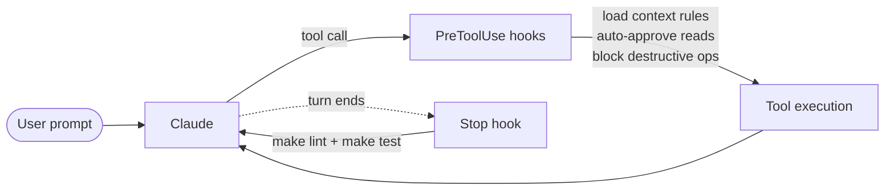

# dotclaude

Shared [Claude Code](https://docs.anthropic.com/en/docs/claude-code) configuration repo, symlinked into `~/.claude/` so edits here propagate to every project automatically.

Manage rules, skills, commands, agents, hooks, and templates in one place instead of duplicating them across every project.

> **Note:** This repo contains scripts that modify files on your system. Please review the contents before use.
>
> **Platform:** Only tested and developed on macOS. Linux may work but is untested; Windows is not supported.

## Why this design

Symlinking into `~/.claude/` and version-controlling everything in git turns this repo into the substrate for the `learn` skill: when Claude updates a rule, skill, or command based on session feedback, the change goes live in every project immediately and shows up as a reviewable git diff — making self-improvement auditable rather than a black box.

**Security-first defaults.** Telemetry and error reporting are disabled, OS-level sandboxing isolates every bash command, and a layered deny/ask permission model plus PreToolUse hooks block destructive operations (`rm -rf`, force-push to `main`) and gate access to credentials, shell config, and cloud tokens — see [settings.json](#settingsjson) for the full posture.

**Scope.** This repo configures Claude Code — it does not bundle a linter or test runner. The Stop hook delegates to whatever the host project uses (`make lint`, `make test`); it skips gracefully when those targets aren't defined.

**Engineering philosophy.** A single stance runs through the engineering artifacts here: deep modules behind simple interfaces, behavior-first testing, and design grounded in the project's domain language.

## Runtime Flow



## What's Included

### [Rules](rules/)

Always-loaded rule files discovered automatically by Claude Code.

| File | Scope | Description |
|------|-------|-------------|
| [general.md](rules/general.md) | All files | No-guessing policy, consistency, check-before-implementing, rules awareness |

### [Context Rules](context-rules/)

Rule files loaded on demand by the `load-context-rules.sh` hook when Edit/Write targets a matching file pattern. Not auto-discovered by Claude Code — the hook controls when they enter context.

| File | Loaded when | Description |
|------|-------------|-------------|
| [py-code.md](context-rules/py-code.md) | Python files | Python style, KISS/YAGNI, error handling, data models |
| [py-test.md](context-rules/py-test.md) | Python test files | pytest conventions, parametrize patterns, test organization |
| [ts-code.md](context-rules/ts-code.md) | TypeScript files | TypeScript style, typing, naming, error handling |
| [docs.md](context-rules/docs.md) | Markdown files | Documentation principles, timeless writing, avoid volatile details |

### [Shared](shared/)

Reference files explicitly read by commands and skills — not auto-loaded.

| File | Description |
|------|-------------|
| [shared/rules-index.md](shared/rules-index.md) | Registry of all rule files — what each covers and when to load it |
| [shared/code-review.md](shared/code-review.md) | Subagent-based review orchestration protocol with parallel batch analysis. Supports two scopes: full (default) and diff-only, selected via a `REVIEW_SCOPE` line set by the including command |
| [shared/analyze-project.md](shared/analyze-project.md) | Project survey steps, imported by `/overview`, `/init-rules`, and `/refine-rules` |
| [shared/project-rules/file-writing.md](shared/project-rules/file-writing.md) | Rule-file shape and writing rules, imported by `/init-rules` and `/refine-rules` |
| [shared/project-rules/claudemd-section.md](shared/project-rules/claudemd-section.md) | CLAUDE.md progressive-disclosure section template, imported by `/init-rules` and `/refine-rules` |

### [Commands](commands/)

**[explore/](commands/explore/)**

| Command | Description |
|---------|-------------|
| [/overview](commands/explore/overview.md) | Build a lightweight, high-level overview of a project |
| [/architecture](commands/explore/architecture.md) | Discover a module's architecture, functionality, and communication interfaces, saved to `docs/architecture/` — excludes tests and CI/CD |

**[project-rules/](commands/project-rules/)**

| Command | Description |
|---------|-------------|
| [/init-rules](commands/project-rules/init-rules.md) | Decompose a fresh project into modules, write per-module `.claude/rules/*.md` files with a `paths` frontmatter, and add a progressive-disclosure table to CLAUDE.md |
| [/refine-rules](commands/project-rules/refine-rules.md) | Audit existing `.claude/rules/*.md` files and apply a minimal delta — modify, split, merge, remove, or add — keeping the CLAUDE.md table in sync |

**[git/](commands/git/)**

| Command | Description |
|---------|-------------|
| [/commit-msg](commands/git/commit-msg.md) | Generate a suggested conventional commit message for the current changes |
| [/pr-summary](commands/git/pr-summary.md) | Brief PR summary grouped by feature/area |

**[review/](commands/review/)**

| Command | Description |
|---------|-------------|
| [/pr-review](commands/review/pr-review.md) | Full technical code review |
| [/pr-review-diff](commands/review/pr-review-diff.md) | Diff-only review of changes to a target branch — reviews only the diff hunks, skips lint/test checks |
| [/delta-review](commands/review/delta-review.md) | Review uncommitted changes against latest commit |
| [/delta-review-diff](commands/review/delta-review-diff.md) | Diff-only review of uncommitted changes — reviews only the diff hunks, skips lint/test checks |
| [/fix-review](commands/review/fix-review.md) | Fix issues found in a code review |
| [/skill-review](commands/review/skill-review.md) | Review a skill or command file for best practices — structure, writing style, progressive disclosure, and prompt engineering |

**[plan/](commands/plan/)**

| Command | Description |
|---------|-------------|
| [/to-plan](commands/plan/to-plan.md) | Synthesize the current conversation into a plan saved under `.claude/plans/` — pairs with the `grill-with-docs` skill |
| [/generate-plan](commands/plan/generate-plan.md) | Generate a plan from a short prompt by researching the target area of the codebase autonomously, saved under `.claude/plans/` |
| [/refine-plan](commands/plan/refine-plan.md) | Refine a plan in place — check logical correctness and rule compliance, then edit the plan to fix issues |
| [/execute-plan](commands/plan/execute-plan.md) | Execute a plan test-first — internalize, sequence the work, implement via the tdd red-green-refactor loop, validate, and verify |

**[parallel/](commands/parallel/)**

| Command | Description |
|---------|-------------|
| [/prep-parallel](commands/parallel/prep-parallel.md) | Set up worktrees for parallel Claude Code agents |
| [/execute-parallel](commands/parallel/execute-parallel.md) | Run parallel task execution |

### [Skills](skills/)

Skills must live flat under `skills/` — Claude Code only discovers a skill whose `SKILL.md` is one level deep, so there are no subdirectories to group by.

| Skill | Description |
|-------|-------------|
| [prompt-engineering](skills/prompt-engineering/SKILL.md) | Prompt crafting and optimization techniques |
| [learn](skills/learn/SKILL.md) | Self-improvement from conversation feedback |
| [skill-creator](skills/skill-creator/) | Create & benchmark skills (vendored, gitignored) |
| [claude-code](skills/claude-code/SKILL.md) | Claude Code configuration & troubleshooting |
| [claude-agent-sdk](skills/claude-agent-sdk/SKILL.md) | Agent SDK implementation patterns |
| [tdd](skills/tdd/SKILL.md) | Test-driven development with the red-green-refactor loop |
| [grill-with-docs](skills/grill-with-docs/SKILL.md) | Grill design decisions, maintaining a CONTEXT.md glossary & ADRs |
| [improve-codebase-architecture](skills/improve-codebase-architecture/SKILL.md) | Find module-deepening refactor opportunities, presented as an HTML report |
| [py-debug](skills/py-debug/SKILL.md) | Python debugging |
| [plugin-browser](skills/plugin-browser/SKILL.md) | Browse, discover, and explore skills/agents/plugins from multiple indexed community and official repos |
| [agent-harness](skills/agent-harness/SKILL.md) | Browse and explore agent harness frameworks and Claude Code resource collections (Archon, everything-claude-code) |

### [Agents](agents/)

| Agent | Description |
|-------|-------------|
| [validation-gates](agents/validation-gates.md) | Runs tests and iterates on fixes until they pass |
| [documentation-manager](agents/documentation-manager.md) | Keeps docs in sync with code changes |

**[review/](agents/review/)**

| Agent | Description |
|-------|-------------|
| [code-reviewer](agents/review/code-reviewer.md) | Focused code reviewer for batches of changed files, dispatched by review commands |
| [code-reviewer-diff](agents/review/code-reviewer-diff.md) | Strict diff-only reviewer for batches of changed files — reads only the diff hunks, never the full files; dispatched by the diff-only review commands |
| [diff-summarizer](agents/review/diff-summarizer.md) | Reads diffs on demand and returns structured change summaries |

### [Hooks](hooks/)

Event-driven shell scripts registered in `settings.json`, or scoped to a single command via its `hooks` frontmatter.

| Hook | Event | Description |
|------|-------|-------------|
| [auto-approve-claude-dir.sh](hooks/auto-approve-claude-dir.sh) | `PreToolUse` | Auto-approves Read, Grep, and Glob operations on `.claude/` paths |
| [load-context-rules.sh](hooks/load-context-rules.sh) | `PreToolUse` | Loads context rules from `context-rules/` on first Edit/Write per session when the target file matches a rule's glob pattern. Deduplicates via transcript markers. Skipped when `DOTCLAUDE_DISABLE_CONTEXT_RULES_HOOK` is set to `1`/`true` |
| [stop-lint-and-test.sh](hooks/stop-lint-and-test.sh) | `Stop` | Runs `make lint` and `make test` after any session that used Edit or Write tools on non-gitignored files. Exits with code 2 to block and prompt Claude to fix failures; skips gracefully when no Makefile or `make` is found; skips individual `lint`/`test` targets that are not defined. `make lint` is skipped when `DOTCLAUDE_DISABLE_AUTO_LINT` is set to `1`/`true`; `make test` when `DOTCLAUDE_DISABLE_AUTO_TEST` is set to `1`/`true` |
| [block-rm-rf.sh](hooks/block-rm-rf.sh) | `PreToolUse` | Blocks destructive `rm -rf` and `rm -fr` Bash commands |
| [block-push-to-main.sh](hooks/block-push-to-main.sh) | `PreToolUse` | Blocks direct `git push` to the `main` branch |
| [block-git-mutations.sh](hooks/block-git-mutations.sh) | `PreToolUse` | Blocks state-mutating `git` commands. Scoped via the `hooks` frontmatter of the read-only review commands (`pr-review`, `pr-review-diff`, `delta-review`, `delta-review-diff`), so it fires only while one of those is active |

### [Output Styles](output-styles/)

Markdown files that modify Claude Code's system prompt to change its role, tone, and default response format. Activate one via `/config` → **Output style**, or set `outputStyle` in a settings file. Takes effect after `/clear` or a new session.

| Style | Description |
|-------|-------------|
| [lean](output-styles/lean.md) | Terse by default, built to be read fast — leads with the answer, cuts filler and bloated comments, holds its ground under pushback, expands only when an idea truly needs the room |

### [Templates](templates/)

| File | Description |
|------|-------------|
| [plan-template.md](templates/plan-template.md) | Plan artifact structure used by the `/to-plan` and `/generate-plan` commands |

### [Scripts](scripts/)

| File | Description |
|------|-------------|
| [statusline-command.sh](scripts/statusline-command.sh) | Custom status line script |
| [index_codebase.py](scripts/index_codebase.py) | Indexes codebase for the claude-context MCP server |

**[review/](scripts/review/)**

| File | Description |
|------|-------------|
| [delta-diff.sh](scripts/review/delta-diff.sh) | Injects a local change overview (stats, file list, current branch) as markdown context — diffs are read on demand by subagents |
| [pr-diff.sh](scripts/review/pr-diff.sh) | Injects a branch change overview (stats, file list, commits, current branch) as markdown context — diffs are read on demand by subagents |
| [automated-checks.sh](scripts/review/automated-checks.sh) | Runs `make lint` and `make test` and injects their output as markdown context for the review. `make lint` is skipped when `DOTCLAUDE_DISABLE_AUTO_LINT` is set to `1`/`true`; `make test` when `DOTCLAUDE_DISABLE_AUTO_TEST` is set to `1`/`true` |
| [latest-review.sh](scripts/review/latest-review.sh) | Outputs the path to the newest code review file in `.claude/.code-reviews/` |
| [remove-latest-review.sh](scripts/review/remove-latest-review.sh) | Deletes the newest code review file in `.claude/.code-reviews/` |

### [settings.json](settings.json)

Shared permissions, preferences, and security posture.

**Privacy:** Three env flags disable telemetry, error reporting, and the feedback survey — Claude doesn't phone home by default. Override per-project if needed.

**Deny list:**
- *Destructive commands:* `rm -rf`, `sudo`, `mkfs`, `dd`, `wget ... | bash` (classic supply-chain attack vector)
- *Irreversible git:* force-push, `git reset --hard`, destructive `git clean` variants (`-f`, `-d`, `-x`), and un-stashing (`git stash pop`/`apply` — can clobber uncommitted work with conflicts)
- *Shell config:* `~/.bashrc`, `~/.zshrc` — PATH manipulation and alias injection are off the table
- *Credential stores:* SSH keys, AWS/Azure/GitHub CLI configs, git-credentials, Docker, Kubernetes, npm/pypi/gem tokens, macOS Keychain, `.env` files — and crypto wallet data (MetaMask, Electrum, Exodus, Phantom, Solflare)

**Ask list** (allowed but requires confirmation):
- *Root-equivalent access:* `docker`, `curl --unix-socket`, `socat *UNIX*`, `nc -U`, `ncat --unixsock` — the Docker socket and arbitrary Unix sockets grant host-level control
- *Permission/ownership:* `chmod`, `chown`
- *Network/data transfer:* `ssh`, `scp`, `rsync` — outbound sessions and file exfiltration vectors
- *Git write operations:* pushing, pulling, merging, rebasing, resetting, branch switching, cleaning, stashing, history rewriting — all state-mutating git commands (the JSON is the source of truth for the exact list)
- *Process control:* `pkill`, `kill`, `launchctl` — killing processes or managing macOS services

**Hooks:** `block-rm-rf.sh` and `block-push-to-main.sh` fire on every `Bash` call as a `PreToolUse` hook, independent of the permission system. If a permission rule is misconfigured, the hook still blocks it.

**Sandboxing:** OS-level filesystem and network isolation for all bash commands and their subprocesses. Bash commands within sandbox boundaries are auto-approved — reducing prompt fatigue while maintaining security. The escape hatch is disabled; commands must run sandboxed or be explicitly excluded. Deny permission rules and sandbox isolation complement each other for defense in depth. `allowAllUnixSockets` and read access to `~/.ssh/known_hosts` are carve-outs for git-over-SSH (agent socket, host-key verification).

## How It Works

Claude Code merges configuration from two levels:

| Level | Location | Scope |
|-------|----------|-------|
| User-level | `~/.claude/` (this repo, via symlinks) | All projects |
| Project-level | `project/.claude/` | That project only |

Array settings (e.g. `permissions.allow`) concatenate across levels. Project-level wins for same-named items.

## Prerequisites

- [Claude Code](https://docs.anthropic.com/en/docs/claude-code) installed
- A `Makefile` in each project with at least: `lint`, `test`, `tree` targets
- Project-level Claude memory lives at `.claude/CLAUDE.md` (not a root-level `CLAUDE.md`) — commands and agents that read or write project memory assume this path

### claude-context

The claude-context MCP server (configured in `.mcp.json`) needs:
- an `OPENAI_API_KEY` set in project root `.env`
- a locally running instance of Milvus vector db
    - check out [this repo](https://github.com/berekvolgyipeter/milvus) to run Milvus via Docker Compose

## Installation

```bash
make install
```

This runs `setup/install.sh`, which symlinks directories and files from this repo into `~/.claude/`:
- **Directories**: `rules/`, `context-rules/`, `commands/`, `agents/`, `skills/`, `output-styles/`, `templates/`, `hooks/`, `scripts/`, `shared/`
- **Files**: `settings.json`

If a real (non-symlink) directory or file already exists at the target, the script warns and skips it. Existing files are backed up with a timestamp before being replaced. Safe to re-run.

## Uninstallation

```bash
make uninstall
```

Removes only symlinks created by `install.sh`. Real directories and files are left untouched. If a backup exists for a file, the most recent backup is restored.

## Fetching Vendored Skills

`skill-creator` is gitignored because it's a large vendored skill. To fetch it:

```bash
make fetch-skill-creator
```

Some skills require Python dependencies:

```bash
make python-deps
```

## Editing Workflow

Because `~/.claude/` directories are symlinks into this repo, editing any file in `~/.claude/rules/`, `~/.claude/skills/`, etc. is editing the real file here. Changes are immediately visible in all projects.

Commit and push from this repo to version-control shared config. No need to touch project repos when updating shared configuration.

## Project-Level Layer

After installing dotclaude, each project's `.claude/` should only contain project-specific overrides:

```
project/.claude/
├── CLAUDE.md              # project-specific instructions
├── settings.json          # project permissions, MCP servers
├── settings.local.json    # personal overrides (gitignored)
├── .gitignore
├── rules/                 # project-specific rules only (if any)
└── skills/                # project-specific skills only (if any)
```

Use `template.CLAUDE.md`, `template.mcp.json`, and `template.serena.project.yml` from this repo as starters when setting up a new project.

## Conventions

- **No project-specific content here.** Rules, commands, or skills referencing a specific project's paths belong in that project's `.claude/`.
- **Context rules** (`context-rules/`) are loaded by the `load-context-rules.sh` hook on Edit/Write — not auto-discovered. Add new context rules there and register their patterns in the hook script.
- **Templates** should be referenced via absolute path: `~/.claude/templates/plan-template.md`.
- **`make lint` / `make test`** in shared commands are acceptable — all projects are assumed to use a Makefile.

## Acknowledgments

- [coleam00/context-engineering-intro](https://github.com/coleam00/context-engineering-intro) — inspiration for some commands and rules
- [trailofbits/claude-code-config](https://github.com/trailofbits/claude-code-config) — security and privacy focused settings
- [EveryInc/compound-engineering-plugin](https://github.com/EveryInc/compound-engineering-plugin) — naming conventions and code review patterns
- [wshobson/agents](https://github.com/wshobson/agents) — Python style and naming patterns; interface-as-contract documentation
- [anthropics/claude-plugins-official](https://github.com/anthropics/claude-plugins-official) — multi-agent code review pattern
- [coleam00/archon](https://github.com/coleam00/archon) — agent-harness skill reference repo
- [affaan-m/everything-claude-code](https://github.com/affaan-m/everything-claude-code) — agent-harness skill reference repo
- [mattpocock/skills](https://github.com/mattpocock/skills) — source of the engineering skills (tdd, grill-with-docs, improve-codebase-architecture) and the `/to-plan` command
- [ghostsecurity/skills](https://github.com/ghostsecurity/skills) — codebase exploration heuristics
- [trailofbits/skills](https://github.com/trailofbits/skills) — evidence-based code analysis patterns
- [obra/superpowers](https://github.com/obra/superpowers) — interface-first module mapping and TDD framing in the plan template
