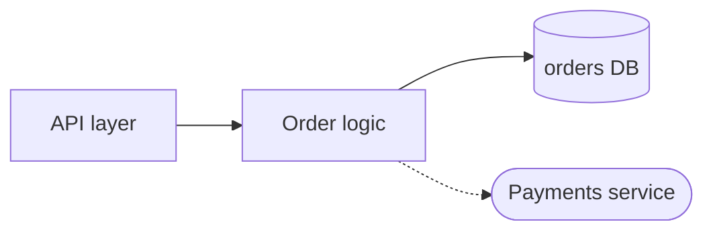

# Architecture Discovery

Explore the module at `$ARGUMENTS` (the whole project if no path is given) and report on its architecture, its functionality, and its communication interfaces.

The reader wants to understand how the module works and how to integrate with it — not how it is developed. Skip tests, CI/CD pipelines, linting, formatting, and build tooling entirely; mention a config file only if it shapes runtime behavior (e.g. wiring, feature flags, connection targets).

## Ground rules

- **Map before reading.** The directory tree (`make tree`, or `ls` if unavailable) provides most of the context. Read selectively: start from entry points, public interface definitions, and 2-3 representative files per module; read further only where tracing a flow requires it.
- **Evidence over inference.** Base every claim on code you actually read and cite it as `file:line`. Where the code doesn't confirm something, write "Unclear — would need to inspect X" instead of guessing.

## Steps

1. **Scope** — resolve the target from the argument. If it's a subdirectory or package, treat everything outside it as an external system the module communicates with.
2. **Map the structure** — get the directory tree, find the entry points (main functions, app factories, handler registrations, exported package surface), and group directories into logical submodules.
3. **Trace functionality** — determine each submodule's responsibility, then follow the 1-3 most important flows end to end (e.g. request in → response out, event consumed → side effects, input file → output artifact). Note where state lives and which submodule owns it.
4. **Inventory interfaces** — for each seam the module exposes or consumes, capture the mechanism/protocol, the key operations with their data shapes, and where it's defined:
   - *Inbound*: HTTP/gRPC/GraphQL endpoints, CLI entry points, consumed queues/topics/events, scheduled jobs, exported library API.
   - *Outbound*: services called, databases, caches, queues/topics published to, external APIs, filesystem contracts.

## Output

Write the report to the `docs/architecture/` directory at the repo root (create it if it doesn't exist). Name the file after the target:

- **No argument** (whole repo): `docs/architecture/ARCHITECTURE.md`.
- **A module path**: `docs/architecture/modules/<module-name>.md`, where `<module-name>` is the basename of the target path (e.g. `services/payments` → `docs/architecture/modules/payments.md`).

**If the target file already exists, update it instead of overwriting.** Read it first, reconcile each section against what you found in the code, and edit only what drifted — correct stale claims, add what's new, remove what no longer exists, and refresh `file:line` references. Preserve sections that still hold and keep the existing structure. When nothing has changed, say so rather than rewriting.

Use the structure below.

### Overview
One paragraph: what the module does, for whom, and its core responsibility.

### Architecture
The logical submodules with a one-line responsibility each, how they depend on each other, and a Mermaid `flowchart` showing submodules plus the external systems they touch. Use a distinct shape for external systems, e.g.:

### Functionality
The main flows traced in step 3, each as a short narrative through the submodules involved, with `file:line` references.

### Communication Interfaces
Two tables:

| Inbound | Mechanism | Operations / contract | Defined in |
|---------|-----------|----------------------|------------|
| REST API | HTTP/JSON | `POST /orders` — create order from `OrderRequest` | `api/routes.py:42` |

| Outbound | Mechanism | Operations / contract | Defined in |
|----------|-----------|----------------------|------------|
| Payments service | gRPC | `Charge(ChargeRequest)` | `clients/payments.py:18` |

### Open Questions
Anything that remained unclear from the code read, phrased as "Unclear — would need to inspect X".
